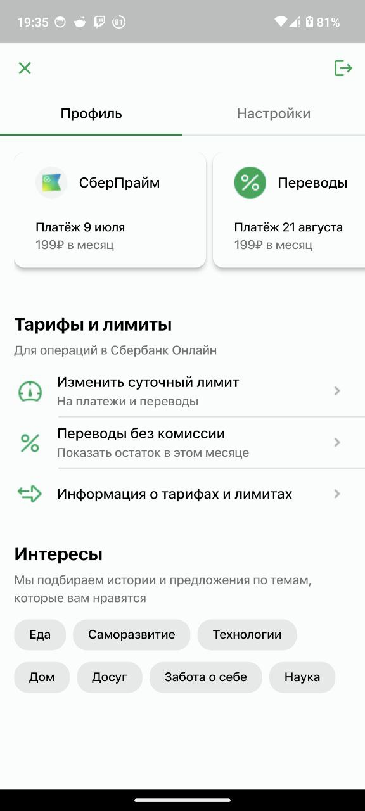

# Лабораторная работа №1 по Flutter
Flutter 3.17.0-12.0.pre.21(also tested with 3.16.9)

Dart 3.3.0 (build 3.3.0-149.0.dev) • DevTools
2.30.0-dev.4

Minimal Dart version of this project 3.1.0 as this major version introduced no changes to the language.

### Note about interface
I decided to keep tab bar instead of name because I think that it is more
useful to the user as (I think) they already know their name and they
can't see other's user profile

## Screenshots
| Home 1                                             | Home 2                                              |
|----------------------------------------------------|-----------------------------------------------------|
|  |  |

| Home rotated                                               |
|------------------------------------------------------------|
|  |

## Installation
apks can be found in `releases` section